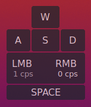

## `screenpad`

* Always-on-top window
* Cross-platform

### known issues

The below issues are known and are being worked upon.

* No transparent background on Windows. (pywebview)
* CPS counter won't reset after pressing Esc.
* May not work be on top of fullscreen games.

